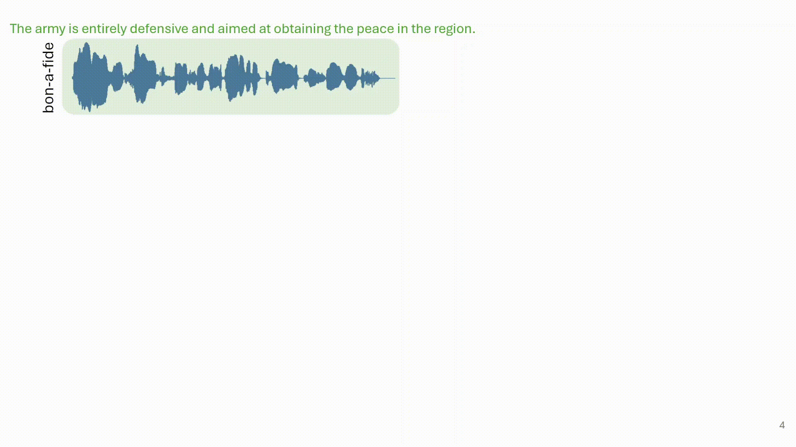
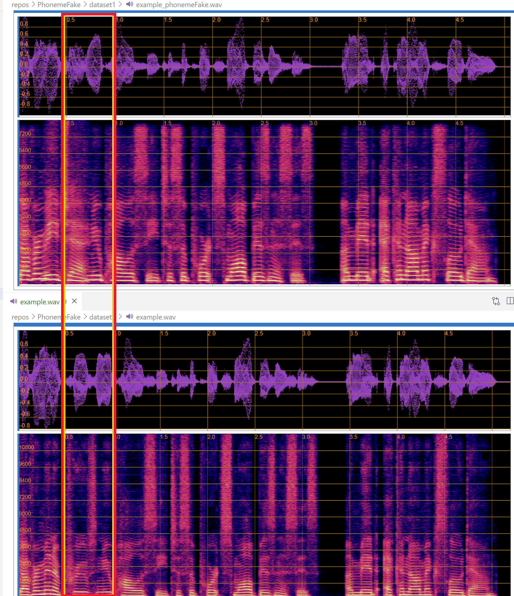
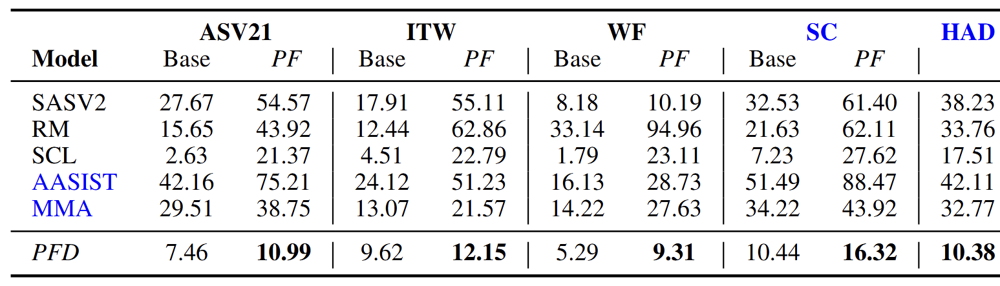

# PhonemeFake: A Phonetic DeepFake Dataset with Fine-Grained Manipulations
## PhonemeFake Synthesis Pipeline

 

## Bilevel Detection Architecture 

 

Put the dataset into the dataset1 folder and run the ``pipe.sh``.

Below image shows the spectograms of the original (top) and DF (bottom) samples for the example audio which vocalizes the transcript:
``Government approves new policy to support small businesses amid economic slowdown.`` The word approves converted to rejects.

 

# Reproducing Script

The `reproduce.sh` script is used to run evaluations on different datasets using  different models and specified versions of the data. This script automates the process of running the evaluation and computing the scores for the models and datasets.

Please refer to the `./reproduce/` folder for more details on benchmark models used, scripts and references.

## Usage 

To run the script, provide detection model, dataset and version as arguments. For example:

```bash
./reproduce.sh <detection model> <dataset> <version>
```

## Arguments

- `<detection model>`: The detection model to be used. Possible values are `conf-3`, `mamba`
- `<dataset>`: The dataset to be evaluated. Possible values are `ASVspoof2021DF`, `ITW`, `WaveFake`
- `<version>`: The version of the dataset to be evaluated. Possible values are `original` or `phonemeFake`.

## Example Commands

- To run the evaluation on the `ASVspoof2021DF` dataset with the `original` version using the `mamba` detection model (RawBMamba):
  ```bash
  ./reproduce.sh mamba ASVspoof2021DF original
  ```

- To run the evaluation on the `ITW` dataset with the `phonemeFake` version using the `conf-3` detection model (SCL Deep Fake Detection's conf-3):
  ```bash
  ./reproduce.sh conf-3 ITW phonemeFake
  ```

# Results

 

## Dataset Directories

The dataset directories are defined at the beginning of the script, please do not forget to update the directories.
